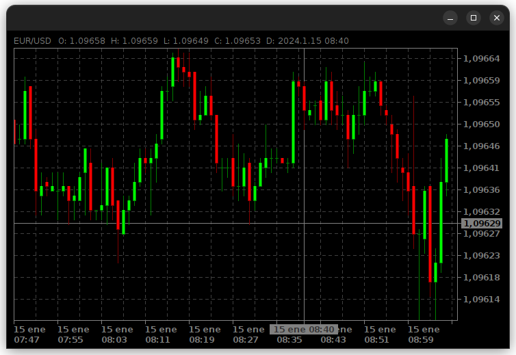

# TraderChart Library

## Versión

Versión actual: `1.0.0`

## Descripción

La librería **TraderChart** proporciona una representación gráfica de velas, comúnmente utilizada en análisis técnico 
financiero para mostrar movimientos de precios. La clase principal, `TraderChart`, extiende de `JPanel` y ofrece métodos 
para configurar y manipular un gráfico de velas, incluyendo la visibilidad de cuadrículas y cursores, el tamaño de las 
velas y la navegación a través de los datos.



## Instalación

Para utilizar esta librería, simplemente añádela a tu proyecto Java y asegúrate de tener las dependencias necesarias.

## Uso

Aquí hay un ejemplo básico de cómo utilizar `TraderChart` en tu aplicación:

```java
import candleChart.TraderChart;
import candleChart.data.Buffer;

public class Main {
    public static void main(String[] args) {
        TraderChart chart = new TraderChart();
        
        // Configura el buffer de datos
        Buffer buffer = new Buffer();
        buffer.addAll(ListaDeVelas);            // Se añade los datos al buffer
        chart.setBuffer(buffer);                // Se carga el buffer en el gráfico
        
        // Personaliza el gráfico
        chart.setGridVisible(true);             // Establece la visibilidad de la cuadrícula
        chart.setCursorVisible(true);           // Establece la visibilidad del cursor
        chart.setCandleSize(CandleSize.SMALL);  // Establece el tamaño de la vela
        chart.setSymbol("EUR/USD");             // Establece el símbolo del gráfico

        // Avanza en el gráfico
        chart.advance();                        // Avanza 1 posición
        chart.advance(5);                       // Avanza 5 posiciones

        // Retrocede en el gráfico
        chart.retrieve();                       // Retrocede 1 posición
        chart.retrieve(5);                      // Retrocede 5 posiciones
    }
} 
```

## Métodos de TraderChart

### setBuffer(Buffer buffer)
Establece un buffer de datos en el gráfico. Si durante la ejecución, el buffer es modificado, los cambios no se 
reflejarán hasta que se llame al método update.

**Parámetros:**
- **buffer:** El nuevo buffer de datos.

**Excepciones:**
- **NullPointerException:** Si el buffer proporcionado es nulo.

### getBuffer()
Obtiene el buffer de datos del gráfico.

**Retorno:** El buffer de datos del gráfico.

### update()
Actualiza el buffer de datos del gráfico.

### setGridVisible(boolean visibility)
Establece la visibilidad de la cuadrícula del gráfico.

**Parámetros:**
- **visibility:** Si es true, la cuadrícula será visible; de lo contrario, será oculta.

### isGridVisible()
Obtiene la visibilidad de la cuadrícula del gráfico.

**Retorno:**
true si la cuadrícula es visible, false en caso contrario.

### setCursorVisible(boolean visibility)
Establece la visibilidad de las líneas del cursor en el gráfico.

**Parámetros:**
- **visibility:** Si es true, las líneas del cursor serán visibles; de lo contrario, serán ocultas.

### isCursorVisible()
Obtiene la visibilidad de las líneas del cursor en el gráfico.

**Retorno:** 
true si las líneas del cursor son visibles, false en caso contrario.

### setCandleSize(CandleSize candleSize)
Establece el tamaño de las velas en el gráfico.

**Parámetros:**
- **candleSize:** El tamaño de las velas a establecer.

**Excepciones:**
- **NullPointerException:** Si la propiedad candleSize proporcionada es nula.

### getCandleSize()
Obtiene el tamaño de las velas establecido en el gráfico.

**Retorno:** 
El tamaño de las velas establecido.

### setSymbol(String symbol)
Establece el símbolo en la barra de información del gráfico

**Parámetros:**
- **symbol:** El símbolo a establecer en el gráfico.

**Excepciones:**
- **NullPointerException:** Si la propiedad symbol proporcionada es nula.

### getSymbol()
Obtiene el símbolo establecido en el gráfico.

**Retorno:**
El símbolo del gráfico.

### advance()
Avanza una posición en el gráfico siempre que haya datos que mostrar.

### advance(int steps)
Avanza en el gráfico el número de pasos proporcionado por parámetros.

**Parámetros:**
- **steps:** Número de pasos a avanzar en el buffer.

**Excepciones:**
- **IllegalArgumentException:** Si el parámetro proporcionado es negativo.

### retrieve()
Retrocede en el gráfico una posición siempre que haya datos que mostrar.

### retrieve(int steps)
Retrocede en el gráfico el número de pasos proporcionado por parámetro, o hasta que haya datos que mostrar.

**Parámetros:**
- **steps:** El número de pasos a retroceder en el buffer.

**Excepciones:**
- **IllegalArgumentException:** Si el parámetro proporcionado es negativo.


## Contribución
Las contribuciones son bienvenidas. Por favor, crea un fork del repositorio y abre una pull request con tus cambios.

## Licencia
Este proyecto está licenciado bajo los términos de la Licencia MIT.